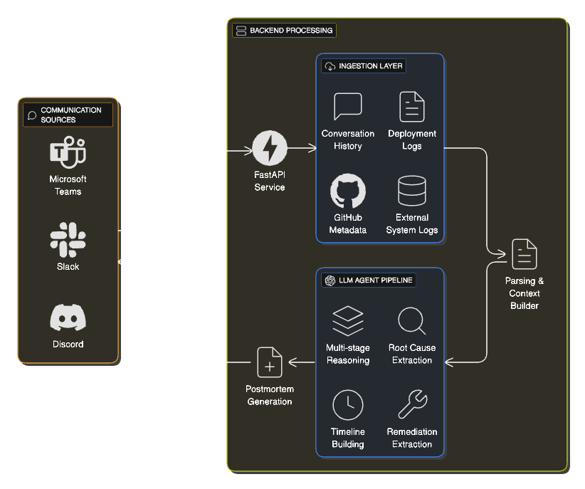

Aftermath AI is an AI-powered postmortem generation agent for SRE and platform engineering teams. It ingests incident data from Slack, Discord, Microsoft Teams and optional deployment/github logs to automatically synthesize structured postmortem reports using LLMs. The objective is to eliminate manual report writing and accelerate incident retrospectives.

## Last Updated

2025-10-23

## Table of Contents

* [Key Features](#key-features)
* [Architecture Overview](#architecture-overview)
* [Data Flow](#data-flow)
* [Configuration](#configuration)
* [Communication Channel Integration](#communication-channel-integration)
* [Usage](#usage)
* [Examples](#examples)
* [Future Roadmap](#future-roadmap)
* [Contributing](#contributing)
* [License](#license)

## Key Features

* Triggerable from incident discussion inside communication platforms (Slack/Discord/Teams)
* Automatic ingestion of conversation logs, deployment logs, and GitHub metadata
* Multi-stage LLM agent pipeline built using LangChain
* Structured postmortem output (Summary → Impact → Timeline → RCA → Remediation)
* Modular ingestion system for additional context sources
* Deployable to Kubernetes and cloud environments

## Architecture Overview



| Layer                   | Responsibility                                              |
| ----------------------- | ----------------------------------------------------------- |
| Ingestion               | Collects raw incident data from communication channels/logs |
| Parsing / Context Build | Normalizes and structures context for the LLM pipeline      |
| LLM Agent               | Synthesizes structured report                               |
| Postmortem Generation   | Produces final postmortem document                          |

## Data Flow

```
Slack/Discord/Teams Trigger → FastAPI Endpoint → Ingestion → Parsing → Agent → LLM → Postmortem
```

## Configuration

Environment variables expected:

| Variable             | Description                          |
| -------------------- | ------------------------------------ |
| SLACK_BOT_TOKEN      | Bot token for Slack (if using Slack) |
| SLACK_SIGNING_SECRET | Verification secret (Slack only)     |
| GITHUB_TOKEN         | Optional: GitHub API access token    |

## Communication Channel Integration

Aftermath AI connects to communication platforms as a context source. Triggers may be:

* Slack Slash Command
* Discord Application Command
* Teams Bot Trigger

The ingestion layer normalizes all of these into a unified communication log context.


## Future Roadmap

* Retry and fallback logic in LLM agent
* Output schema validation
* Multi-incident memory
* Web UI dashboard
* Modifiable output structure
* Expanded communication/context sources

## Contributing

Pull requests are welcome.

## License

TBD
